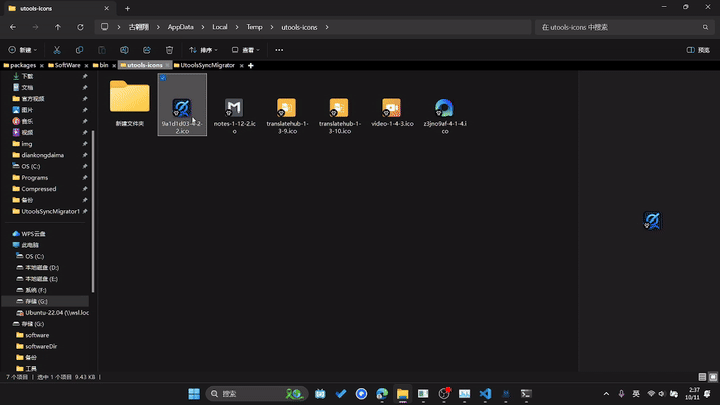

> This project is for utools backup use, for personal use only, other people use this project for commercial or other purposes have nothing to do with me.

# Backup 
Make a backup using the backup script (on your original computer)

# Synchronize on the new computer
! It is recommended to use `beifen.ps1` again to prevent the loss of your data!

Translated with DeepL.com (free version)